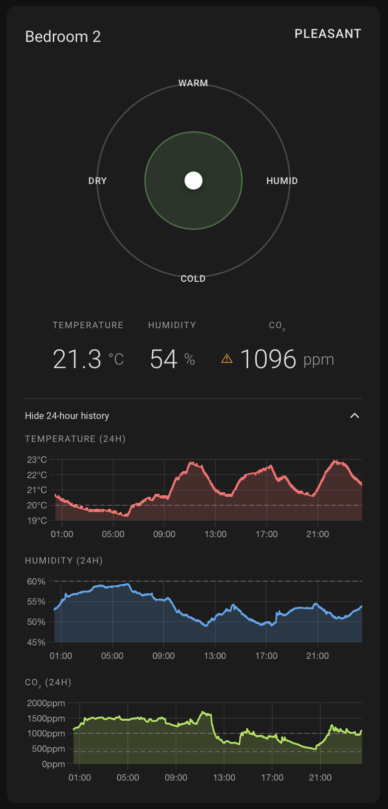

# Air Comfort Card

[](https://github.com/custom-components/hacs)
[](https://opensource.org/licenses/MIT)

A custom Home Assistant card that visualizes indoor air comfort using temperature and humidity sensors. The card combines both values into a single circular "comfort dial" with a moving dot indicator, showing whether a room feels cold, warm, dry, humid, or comfortable.



## Features

- 🎯 **Circular Comfort Dial**: Visual representation of comfort zones with color-coded regions
- 📍 **Moving Indicator**: Dynamic dot that shows current conditions on the dial
- 🌡️ **Temperature & Humidity Display**: Clear readings with customizable units
- 📊 **24-Hour History Charts**: Line graphs showing temperature and humidity trends over the last 24 hours
- 🎨 **Theme-Aware**: Automatically adapts to your Home Assistant theme
- ⚙️ **Configurable**: Customize visibility of different elements via YAML
- 🧹 **Clean & Intuitive**: Modern design inspired by thermostat apps
- 🔧 **TypeScript + Lit + Chart.js**: Built with modern web technologies

## Installation

### HACS (Recommended)

1. Open HACS in your Home Assistant instance
2. Click on "Frontend"
3. Click the three dots in the top right corner
4. Select "Custom repositories"
5. Add this repository URL: `https://github.com/mrded/ha-air-comfort-card`
6. Select category "Lovelace"
7. Click "Add"
8. Find "Air Comfort Card" in the list and click "Install"
9. Restart Home Assistant

### Manual Installation

1. Download the `air-comfort-card.js` file from the [latest release](https://github.com/mrded/ha-air-comfort-card/releases)
2. Copy it to your `config/www` folder
3. Add the following to your `configuration.yaml`:

```yaml
lovelace:
  resources:
    - url: /local/air-comfort-card.js
      type: module
```

4. Restart Home Assistant

## Configuration

The card can be configured either through the **visual editor** (recommended) or manually via YAML.

### Visual Editor

1. Add a new card to your dashboard
2. Search for "Air Comfort Card"
3. Select your temperature and humidity sensors
4. Customize the card title and display options
5. Save the card

### Basic Configuration (YAML)

```yaml
type: custom:air-comfort-card
temperature_entity: sensor.living_room_temperature
humidity_entity: sensor.living_room_humidity
```

### Full Configuration (YAML)

```yaml
type: custom:air-comfort-card
temperature_entity: sensor.living_room_temperature
humidity_entity: sensor.living_room_humidity
co2_entity: sensor.living_room_co2
name: Living Room Comfort
show_temperature_graph: true
show_humidity_graph: true
show_co2_graph: true
temp_min: 20
temp_max: 24
humidity_min: 40
humidity_max: 60
co2_min: 400
co2_max: 1000
```

### Configuration Options

| Name | Type | Required | Default | Description |
|------|------|----------|---------|-------------|
| `type` | string | **Yes** | - | Must be `custom:air-comfort-card` |
| `temperature_entity` | string | **Yes** | - | Entity ID of your temperature sensor |
| `humidity_entity` | string | **Yes** | - | Entity ID of your humidity sensor |
| `co2_entity` | string | No | - | Entity ID of your CO2 sensor |
| `name` | string | No | `Air Comfort` | Custom title for the card (editable via visual editor) |
| `show_temperature_graph` | boolean | No | `true` | Show/hide the 24-hour temperature graph |
| `show_humidity_graph` | boolean | No | `true` | Show/hide the 24-hour humidity graph |
| `show_co2_graph` | boolean | No | `true` | Show/hide the 24-hour CO2 graph |
| `temp_min` | number | No | `20` | Lower bound of comfortable temperature (°C) |
| `temp_max` | number | No | `24` | Upper bound of comfortable temperature (°C) |
| `humidity_min` | number | No | `40` | Lower bound of comfortable humidity (%) |
| `humidity_max` | number | No | `60` | Upper bound of comfortable humidity (%) |
| `co2_min` | number | No | `400` | Lower bound of comfortable CO2 (ppm) |
| `co2_max` | number | No | `1000` | Upper bound of comfortable CO2 (ppm) |

## How It Works

The card calculates comfort levels based on commonly accepted indoor comfort standards:

- **Ideal Zone**: 20-24°C (68-75°F) with 40-60% humidity
- **Color Zones**:
  - 🟢 **Green**: Perfect comfort
  - 🟡 **Yellow**: Acceptable/slightly uncomfortable
  - 🔴 **Red**: Uncomfortable conditions
  - 🔵 **Blue**: Very uncomfortable

The moving dot indicator shows your current conditions relative to these zones, making it easy to see at a glance whether your indoor environment needs adjustment.

## Development

### Prerequisites

- [Bun](https://bun.sh/) (or Node.js 16+ with npm)

### Building from Source

```bash
# Clone the repository
git clone https://github.com/mrded/ha-air-comfort-card.git
cd ha-air-comfort-card

# Install dependencies
bun install

# Build the card
bun run build

# Watch for changes (development)
bun run watch
```

The compiled file will be in the `dist` folder.

## Contributing

Contributions are welcome! Please feel free to submit a Pull Request.

## License

This project is licensed under the MIT License - see the [LICENSE](LICENSE) file for details.

## Support

If you have questions or issues:

1. Check the [documentation](https://github.com/mrded/ha-air-comfort-card)
2. Search existing [issues](https://github.com/mrded/ha-air-comfort-card/issues)
3. Create a new issue if needed

## Credits

Inspired by modern thermostat interfaces and the need for better indoor air quality monitoring in Home Assistant.
